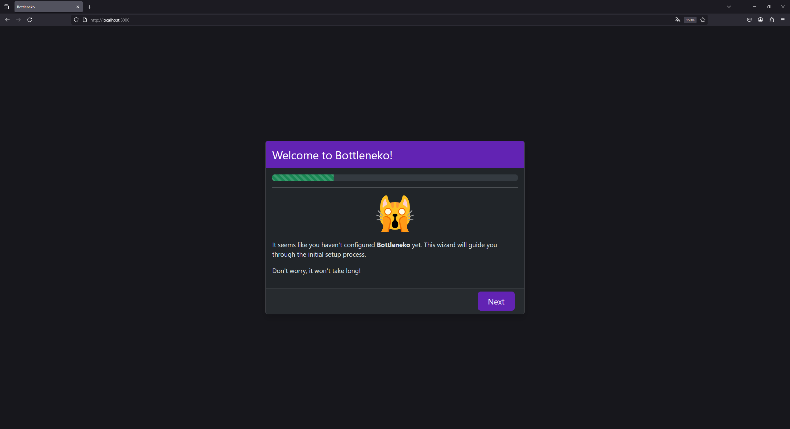
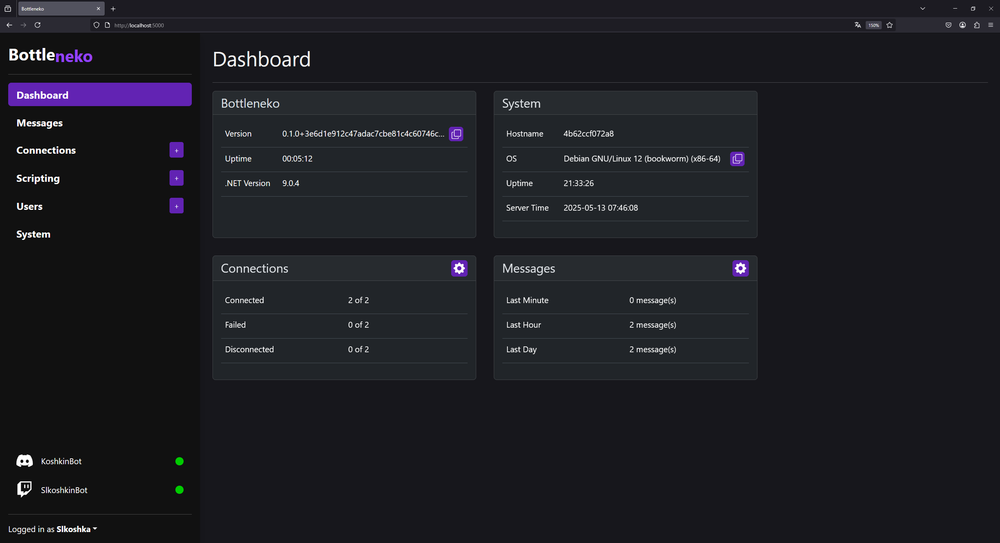
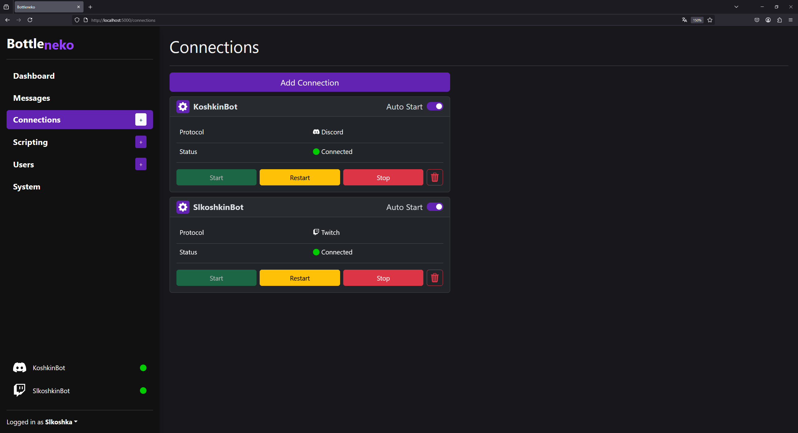
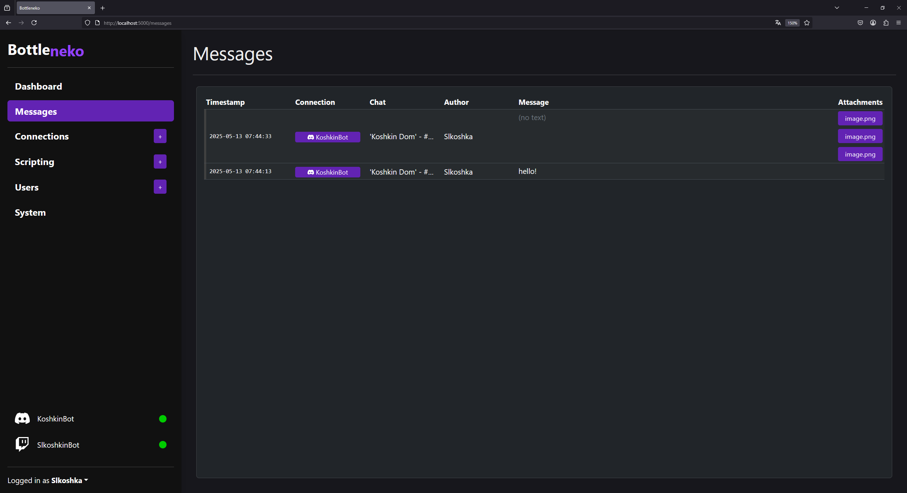
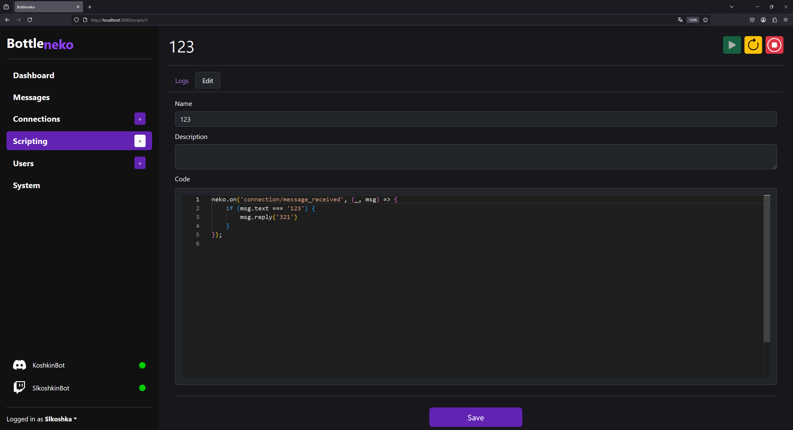
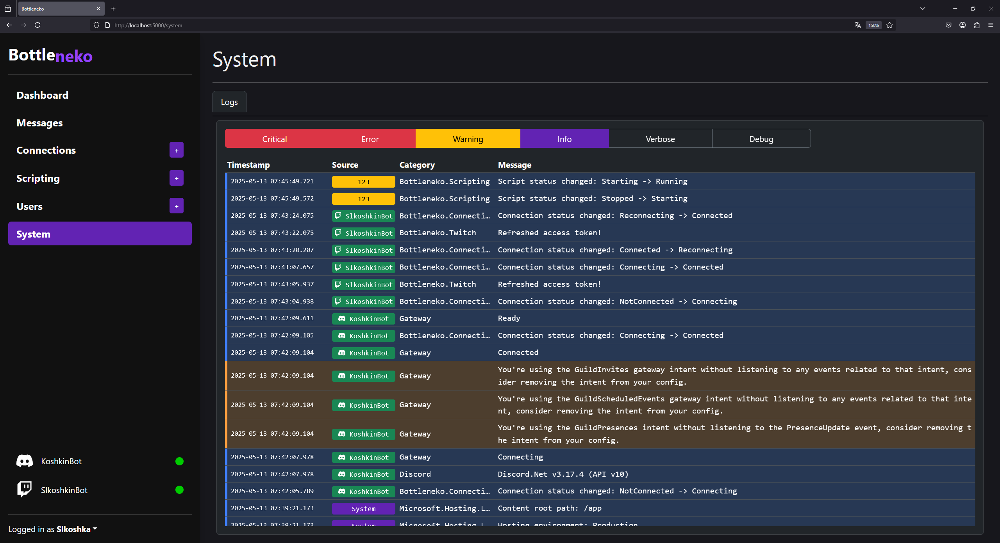

<div align="center">
    </img>
</div>

**Bottleneko** is a scriptable multi protocol chat bot.

Supported protocols:
* **Discord**
* **Telegram**
* **Twitch**

## Project status

The project is currently in the **early development stage** and only intended for developers. Don't expect to see any documentation. Stuff can break. You know how it usually is.

## Quick start

The only currently supported way to run **Bottleneko** is via **Docker**.

### Setup inside Docker

Download and create the **Bottleneko** container:

```shell
$ docker run --detach \
    --name Bottleneko \
    --volume /path/to/persistent/storage:/data
    --expose 5000:5000
    slkoshka/bottleneko
```

Bottleneko has now been installed.

Now that the installation is complete, you can start the initial setup wizard by opening a web browser and going to `http://localhost:5000`.

## Future plans

* Documentation
* Desktop app (via Electron)
* Visual/no-code scripting
* Expose more protocol-specific functionality in the scripting API

## Requirements

* Docker
* x86-64 or ARM64 CPU

For development:
* .NET SDK 9.0

## Useful links

* Scripting API type definitions
    * Automatically generated from C#: [`script.gen.d.ts`](Bottleneko.Client/src/features/scripts/script.gen.d.ts)
    * Manually defined API: [`script.api.d.ts`](Bottleneko.Client/src/features/scripts/script.api.d.ts)

## Development

1. Clone the repository
2. Open [`Bottleneko.sln`](Bottleneko.sln) in your favorite .NET IDE ([**Visual Studio**](https://visualstudio.microsoft.com/) and [**JetBrains Rider**](https://www.jetbrains.com/rider/) both work well)
3. Run `Bottleneko.AppHost`

### Building Docker image

```shell
$ docker build . -t slkoshka/bottleneko:dev
```

## Screenshots

<a href="docs/assets/screenshot1.png"></img></a>
<a href="docs/assets/screenshot2.png"></img></a>
<a href="docs/assets/screenshot3.png"></img></a>
<a href="docs/assets/screenshot4.png"></img></a>
<a href="docs/assets/screenshot5.png"></img></a>
<a href="docs/assets/screenshot6.png"></img></a>
